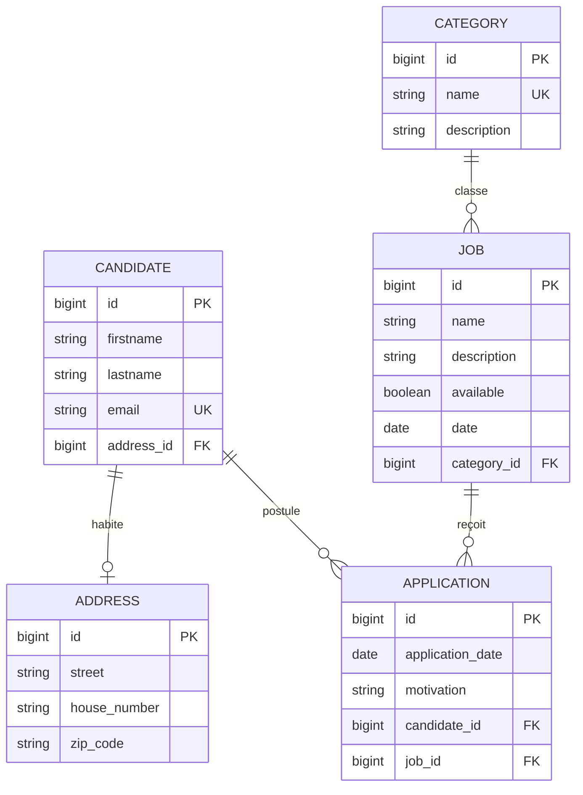

# AWD – Plateforme de recrutement (version monolithique)

Application **Spring Boot RESTful monolithique** qui regroupe les trois domaines du projet AWD :

- **Gestion candidat** : candidats et adresses
- **Gestion job** : offres d'emploi et catégories
- **Gestion candidature** : un candidat postule à un job

Une seule application, **une seule base MySQL**, une seule documentation Swagger.
C'est le **point de départ** avant la migration vers l'architecture microservices (candidat, job, candidature + Eureka).

---

## 🧩 Modèle de données



Une **candidature** (`application`) fait le lien entre un **candidat** et un **job** : un candidat peut avoir plusieurs candidatures, un job peut en recevoir plusieurs.

---

## ▶️ Démarrage

### 1. Créer la base de données
MySQL doit tourner sur `localhost:3306` (utilisateur `root`, mot de passe vide par défaut).

```bash
mysql -u root -p < database/awd_db.sql
```
ou importer `database/awd_db.sql` dans phpMyAdmin / MySQL Workbench.
Le script crée la base `awd_db`, les 5 tables avec leurs contraintes, et des données d'exemple
(4 candidats, 3 catégories, 5 jobs, 5 candidatures).

Autres identifiants MySQL ? Modifier `spring.datasource.username` / `password` dans `src/main/resources/application.properties`.

### 2. Lancer l'application
```bash
mvn spring-boot:run
```

- Swagger UI : http://localhost:8080/swagger-ui.html
- OpenAPI JSON : http://localhost:8080/v3/api-docs/0-all

Dans Swagger UI, la liste déroulante **« Select a definition »** (en haut à droite) permet d'afficher
toute l'API (`0-all`) ou un seul module (`1-candidat`, `2-job`, `3-candidature`) : ce sont les futurs microservices.

`spring.jpa.hibernate.ddl-auto=none` : c'est le script SQL qui crée les tables, Hibernate n'y touche pas.

---

## 📚 Endpoints

### Gestion candidat
| Méthode | URL | Description |
|---|---|---|
| GET | /api/candidates | Liste des candidats |
| GET | /api/candidates/{id} | Un candidat (avec son adresse) |
| POST | /api/candidates | Créer un candidat (adresse optionnelle) |
| PUT | /api/candidates/{id} | Modifier un candidat |
| DELETE | /api/candidates/{id} | Supprimer un candidat (409 s'il a des candidatures) |
| PUT | /api/candidates/{id}/address/{addressId} | Associer une adresse existante |
| DELETE | /api/candidates/{id}/address | Détacher l'adresse |
| GET / POST / PUT / DELETE | /api/addresses[/{id}] | CRUD des adresses |

### Gestion job
| Méthode | URL | Description |
|---|---|---|
| GET | /api/jobs?available=&categoryId= | Liste des jobs (filtres optionnels) |
| GET | /api/jobs/{id} | Un job |
| POST | /api/jobs | Créer un job |
| PUT | /api/jobs/{id} | Modifier un job |
| PATCH | /api/jobs/{id}/availability?available=false | Ouvrir / fermer un job |
| DELETE | /api/jobs/{id} | Supprimer un job (409 s'il a des candidatures) |
| GET / POST / PUT / DELETE | /api/categories[/{id}] | CRUD des catégories |
| GET | /api/categories/{id}/jobs | Jobs d'une catégorie |

### Gestion candidature
| Méthode | URL | Description |
|---|---|---|
| GET | /api/applications?candidateId=&jobId= | Liste des candidatures (filtres optionnels) |
| GET | /api/applications/{id} | Une candidature (avec résumé du candidat et du job) |
| POST | /api/applications | Postuler à un job |
| PUT | /api/applications/{id} | Modifier la motivation / la date |
| DELETE | /api/applications/{id} | Retirer une candidature |
| GET | /api/candidates/{id}/applications | Candidatures d'un candidat |
| GET | /api/jobs/{id}/applications | Candidatures reçues pour un job |

### Règles métier
- Un candidat ne peut postuler **qu'une seule fois** au même job → `409 Conflict`
- On ne peut postuler qu'à un job **disponible** (`available = true`) → sinon `409 Conflict`
- `applicationDate` est facultative (date du jour par défaut) et ne peut pas être dans le futur
- Un candidat ou un job qui a des candidatures ne peut pas être supprimé → `409 Conflict`
- Email de candidat et nom de catégorie uniques → `409 Conflict`

Erreurs au format JSON RFC 7807 : `400` validation, `404` introuvable, `409` conflit.

### Exemple
```json
POST /api/applications
{
  "candidateId": 4,
  "jobId": 1,
  "motivation": "Je souhaite rejoindre une équipe qui travaille avec Spring Cloud.",
  "applicationDate": "2026-09-29"
}
```
Réponse `201 Created` :
```json
{
  "id": 6,
  "applicationDate": "2026-09-29",
  "motivation": "Je souhaite rejoindre une équipe qui travaille avec Spring Cloud.",
  "candidate": { "id": 4, "firstname": "Lina", "lastname": "Mansour", "email": "lina.mansour@example.com" },
  "job": { "id": 1, "name": "Java Spring Boot Developer", "available": true, "category": "Software Development" }
}
```

---

## 🗂️ Structure du projet

Le code est organisé **par domaine métier** (*package by feature*) : chaque package deviendra un microservice.

```
src/main/java/com/awd/monolith
├── AwdMonolithApplication.java
├── candidat/        → futur microservice CANDIDAT
│   ├── controller/  CandidateController, AddressController
│   ├── dto/  entity/  mapper/  repository/  service/
├── job/             → futur microservice JOB
│   ├── controller/  JobController, CategoryController
│   ├── dto/  entity/  mapper/  repository/  service/
├── candidature/     → futur microservice CANDIDATURE
│   ├── controller/  ApplicationController
│   ├── dto/  entity/  mapper/  repository/  service/
└── common/
    ├── config/      OpenApiConfig (Swagger + groupes par module)
    └── exception/   GlobalExceptionHandler, ResourceNotFoundException, ConflictException
database/awd_db.sql  script de création de la base
```

---

## 🔀 Du monolithe aux microservices

Points de couplage à casser lors de la migration (à observer dans le code) :

| Dans le monolithe | Après la migration |
|---|---|
| Une base `awd_db` partagée par les 3 modules | Une base par microservice |
| `Application` a des `@ManyToOne` vers `Candidate` et `Job` (vraies clés étrangères) | `Application` stocke seulement `candidateId` et `jobId` |
| `ApplicationService` appelle `CandidateService` et `JobService` (appel Java en mémoire) | Appels HTTP vers CANDIDAT et JOB avec **OpenFeign** + **Eureka** |
| Une seule transaction couvre la vérification du candidat, du job et l'enregistrement | Plus de transaction partagée : gérer les services indisponibles |
| `CandidateService` / `JobService` lisent la table `application` avant une suppression | Le service candidature doit être interrogé (ou on accepte des données orphelines) |
| Un seul port (8080) et un seul Swagger | Un port et un Swagger par service (8081, 8082, 8085…) |

---

## ✅ Tests
```bash
mvn test
```
Les tests d'intégration tournent sur une base H2 en mémoire (mode MySQL) : MySQL n'est pas nécessaire pour les tests.

---

## 🏫 Cadre pédagogique

### Enseignante : [Badia Bouhdid](https://www.linkedin.com/in/badiabouhdid)

Projet développé dans le cadre du module **Applications Web Distribuées**, à l'**École d'Ingénieurs ESPRIT**.
